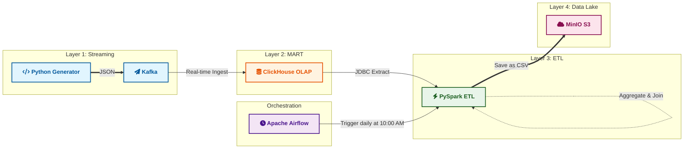
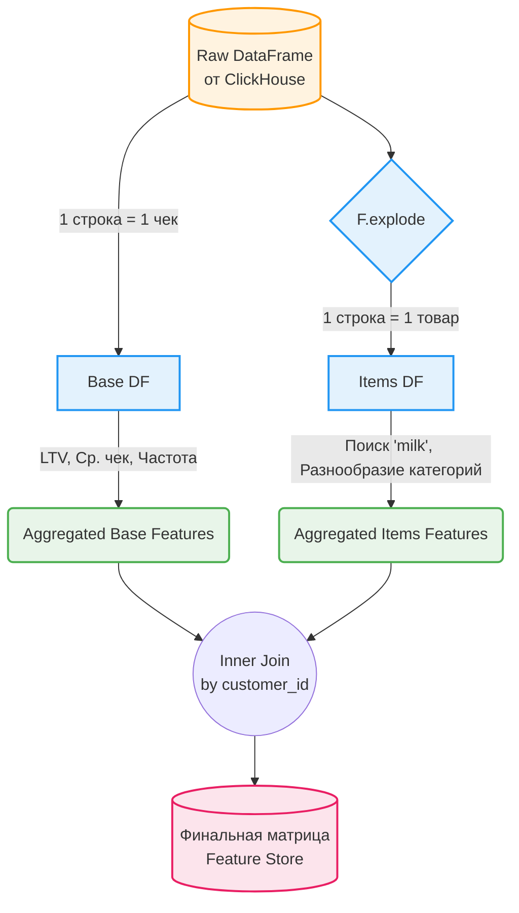

# 🛒 E-Commerce Data Pipeline & Feature Store


💡 Идея проекта: От разрозненных транзакций к единому профилю клиента.

Автоматизированный End-to-End конвейер, трансформирующий поток сырых событий в обогащенные профили клиентов для аналитики.

⚡ Высокопроизводительный прием данных в реальном времени (Kafka → ClickHouse). \
⚙️ Распределенная обработка и агрегация признаков (PySpark) для формирования Feature Store. \
📊 Интерактивная CVM-аналитика (Streamlit) и подготовка датасетов для обучения ML-моделей. \
🏗 Автоматизация жизненного цикла данных и управление зависимостями пайплайна (Airflow).

🎯 Результат: Готовая экосистема для сегментации аудитории, прогнозирования оттока и поиска скрытых паттернов поведения.

## 🧬 Архитектура конвейера 

Пайплайн спроектирован по гибридной архитектуре (Streaming + Batch). 

Сырые данные генерируются в Kafka и оседают в ClickHouse (MART слой). Затем PySpark извлекает данные, рассчитывает сложные бизнес-метрики и выгружает готовый Feature Store в S3-хранилище. Оркестрация и расписание контролируются Apache Airflow.



## 🎯 Бизнес-ценность: Матрица признаков (Feature Store)

На выходе пайплайн генерирует обогащенную витрину (13+ уникальных метрик на клиента), готовую для передачи Data Science команде (прогнозирование оттока, кластеризация) или аналитикам:

* **Поведенческие паттерны:** `recurrent_buyer`, `recent_high_spender`, `night_shopper`, `morning_shopper`.
* **Финансовые метрики:** `lifetime_value` (LTV), `avg_receipt`, `bulk_buyer`, `low_cost_buyer`.
* **Продуктовая аналитика (JSON parsing):** `bought_milk_last_30d`, `varied_shopper` (покупки в 4+ разных категориях), `family_shopper` (корзина ≥ 4 позиций).
* **Лояльность:** `loyal_customer`, `delivery_user`.

## 📁 Структура репозитория 

В проекте используется модульная структура, разделяющая код инфраструктуры, логику оркестрации и скрипты обработки данных:

```text
📦 E-Commerce Data Pipeline
 ┣ 📂 dags                       # Направляемые ациклические графы (DAGs)
 ┃ ┗ 📜 spark_dag.py             # Логика оркестрации пайплайна в Airflow
 ┣ 📂 src                        # Исходный код пайплайна
 ┃ ┣ 📜 spark_etl.py             # Ядро: Трансформации PySpark и логика Feature Store
 ┃ ┣ 📜 streamlit_app.py         # BI Модуль: Интерактивный дашборд клиентского опыта
 ┃ ┣ 📜 data_generate.py         # Модуль: Генератор синтетических профилей и чеков
 ┃ ┣ 📜 producer.py              # Модуль: Отправка потоковых событий в Kafka
 ┃ ┣ 📜 requirements.txt         # Зависимости фронтенда (Streamlit)
 ┃ ┣ 📜 etl_job.py               # Модуль: Альтернативные сценарии загрузки
 ┃ ┗ 📜 load_to_nosql.py         # Модуль: Интеграция с NoSQL решениями
 ┣ 📜 docker-compose.yml         # Инфраструктура Storage (ClickHouse, MinIO, Kafka, Zookeeper)
 ┣ 📜 docker-compose-airflow.yml # Инфраструктура Orchestration (Airflow, PostgreSQL, Redis)
 ┣ 📜 Dockerfile                 # Кастомный образ: Airflow + Java + PySpark + ClickHouse JDBC
 ┣ 📜 Makefile                   # Автоматизация команд запуска
 ┣ 📜 requirements.txt           # Зависимости инфраструктуры
 ┣ 📜 .env.example               # Шаблон переменных окружения
 ┣ 📜 .gitignore                 # Исключения для Git
 ┗ 📜 README.md                  # Документация проекта
```

## 🛠️ Как развернуть и запустить локально

Вся инфраструктура упакована в Docker для быстрого старта "в один клик".

#### Шаг 1: Подготовка окружения

Склонируйте репозиторий и создайте необходимые директории для корректной работы Apache Airflow (во избежание проблем с правами доступа):

```bash
git clone https://github.com/user-134/DE_test.git
cd DE_test/final_project

# Создаем папки для монтирования volumes Airflow
mkdir -p ./logs ./plugins

# Копируем шаблон переменных окружения
cp .env.example .env
```
#### Шаг 2: Запуск слоя хранения и оркестрации (через Makefile)

В проекте настроен Makefile для удобного управления контейнерами:

```bash
# 1. Поднимаем базовую инфраструктуру (ClickHouse, MinIO, Kafka)
make up-infra

# 2. Собираем кастомный образ и запускаем Airflow
make up-airflow
```

(При первом запуске Airflow потребуется около минуты на инициализацию базы данных).

#### Шаг 3: Генерация потоковых данных 

Чтобы конвейеру было с чем работать, запустите скрипт-продюсер. Он сгенерирует синтетические транзакции и отправит их в Kafka:

```bash
pip install -r requirements.txt
make generate-data
```
#### Шаг 4: Доступ к интерфейсам и запуск DAG

Система работает в фоне. Мониторинг осуществляется через Web-интерфейсы:

- 🎯 Airflow UI: http://localhost:8080 (Логин/Пароль: airflow / airflow)

- 🪣 MinIO Console (S3): http://localhost:9001 (Логин/Пароль: admin / adminpassword)

- 📊 ClickHouse: localhost:8123

Зайдите в Airflow, найдите DAG spark_customer_features, переведите тумблер в состояние Unpause и нажмите Trigger DAG (▶️).

---

## 📸 Результаты работы конвейера

✅ Успешное выполнение направленного графа (DAG) в Apache Airflow:


✅ Сформированная матрица признаков, выгруженная в MinIO (S3):


---

## 📊 Monitoring & Data Quality

Проект реализует концепцию **Data Reliability**. Мы не просто перемещаем данные, мы следим за их качеством на каждом этапе.

### 1. Data Quality Layer (ClickHouse MV)
Для перехода из RAW в MART слой используются Materialized Views. SQL-логика обеспечивает:
* **Deduplication:** Исключение дублей на этапе вставки.
* **Validation:** Проверка адекватности дат и очистка персональных данных (шифрование Email/Phone).
* **Normalization:** Приведение всех текстовых атрибутов к нижнему регистру.

### 2. Grafana Dashboard & Telegram Alerting
Для визуализации состояния системы и оперативного реагирования настроена интеграция с **Grafana** и **Telegram Bot**:

* **Dashboard:** Отображает в реальном времени количество загруженных объектов:
  - Магазины: 45 активных точек.
  - Транзакции: 200+ уникальных покупок.
  - Revenue Analytics: Динамика выручки по дням на основе сырых логов.
    
* **Alerting:** Настроен мониторинг уровня дублей. Если количество дубликатов в исходных данных превышает 50%, срабатывает алерт, и команда моментально получает уведомление в Telegram.

> *Визуализация данных в Grafana:*


 
> *Пример уведомления от Telegram Bot:*


---
## 📱 Data App: Интерактивный CVM-Дашборд

Для демонстрации Data Value, поверх S3-хранилища развернуто веб-приложение на базе Streamlit и Plotly. Приложение реализует динамическую сегментацию клиентов и анализ паттернов:
- Стратегический Дашборд: Мониторинг ключевых KPI (LTV, Активная база, Уровень оттока), визуализация воронок конверсии и распределения выручки по сегментам.
- Аналитика Признаков: Глубокий анализ выбросов через Box Plots и сравнение поведенческих признаков (VIP vs Отток) для поиска инсайтов.
- Массив данных: Визуализация сырой матрицы признаков (Feature Store) с градиентной подсветкой и возможностью выгрузки в CSV для передачи Data Science команде.

Приложение спроектировано с учетом отказоустойчивости (Graceful Degradation): при недоступности хранилища MinIO генерируется богатый DEMO-датасет.

---

[](https://appapppy-nxqrz9bm7lzqetzthw3ck3.streamlit.app/)

---

📸 Скриншоты дашборда:


---

## 🧠 Логика PySpark ETL

Самая интересная техническая задача проекта — обработка полуструктурированных данных без потери производительности и искажения метрик. В исходном слое (ClickHouse) корзина покупателя хранится в виде сырого строкового JSON-массива: `[{"category": "milk"}, {"category": "bread"}]`.

Чтобы рассчитать корректные бизнес-метрики, пайплайн использует паттерн **Split-Aggregation**.

#### 1. Парсинг и Развертывание (The Explode)
PySpark строго типизирует сырую строку через `StructType` и применяет функцию `F.explode`, превращая один чек в набор независимых строк (одна строка = один товар).

```python
# Извлекаем категории для продуктовой аналитики
df_exploded = df_base.withColumn("item", F.explode(F.from_json(F.col("items"), items_schema)))
```
#### 2. Split-Aggregation Pattern (Защита от дублей)
Если считать средний чек (Base metric) на "взорванных" данных, чеки с большим количеством товаров получат больший математический вес, что приведет к искажению аналитики. Поток данных физически разделяется на две ветки агрегации, которые затем безопасно сшиваются обратно:


#### 3. Идемпотентность и Оркестрация (Airflow Safe)

Пайплайн спроектирован так, что повторный запуск задачи (Retry) при сбое не приведет к дублированию данных: 
* **Overwrite Mode:** Данные записываются в S3 с использованием `mode("overwrite")`.
* **Dynamic Partitioning:** Имя финального файла формируется динамически (`analytic_result_YYYY_MM_DD`), гарантируя консистентность срезов данных по дням.

---

## 🚀 Дальнейшее развитие

- [ ] Интеграция `dbt` для управления трансформациями на слое DWH.
- [ ] Добавление метрик качества данных (Data Quality checks) через `Great Expectations`. 
- [ ] Развертывание дашборда `Apache Superset` поверх финальной витрины для визуализации оттока.
